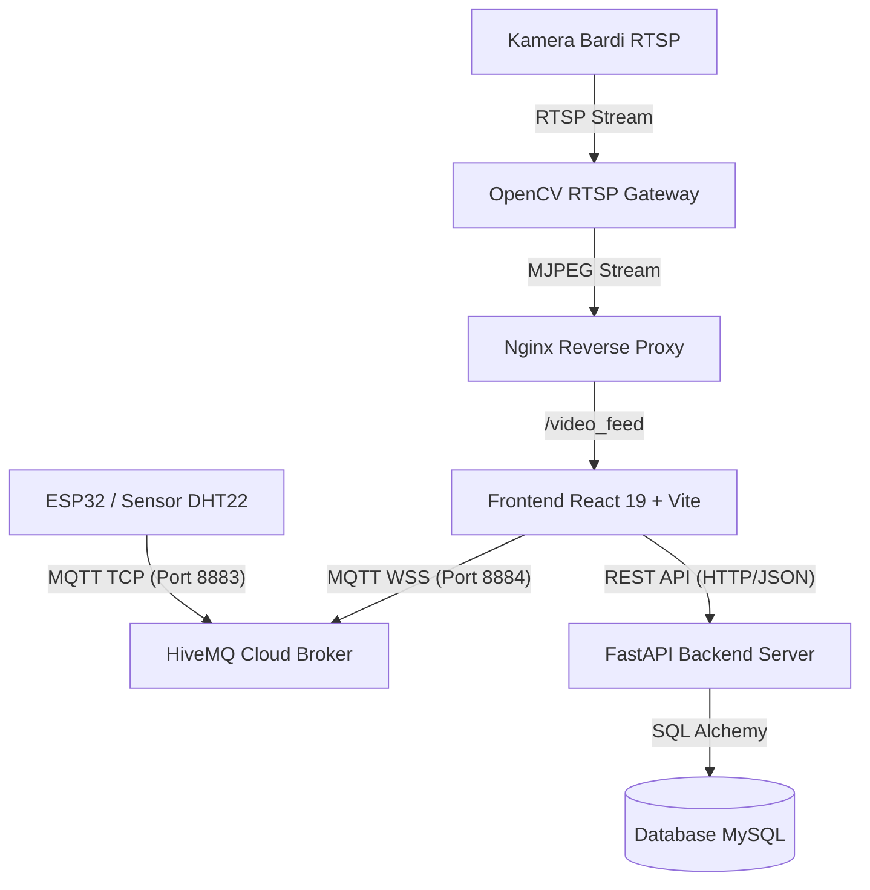

# 🪶 Kampung Merak - Dashboard Inkubator Telur Merak IoT

Dashboard cerdas berbasis web untuk pemantauan, pencatatan silsilah, kendali aktuator, dan live streaming CCTV pada mesin **Inkubator Telur Merak (Kampung Merak)**.

Sistem ini mengintegrasikan mikrokontroler **ESP32**, broker cloud **HiveMQ**, REST API **FastAPI (Python) + MySQL**, gateway streaming **OpenCV**, dan antarmuka web modern berbasis **React 19 + Tailwind CSS**.

---

## 🌟 Fitur Utama

- 🌡️ **Monitoring Telemetri Real-Time:** Pembacaan suhu dan kelembaban inkubator secara instan via protokol MQTT WebSocket (HiveMQ Cloud).
- 💡 **Kendali Aktuator:** Sakelar lampu candling LED dan trigger manual mist maker (kelembaban).
- 🥚 **Visualisasi Nampan Telur (Egg Tray):** Tampilan grid 50 slot telur dengan pemetaan status sinkron (*Fertil, Infertil, Menetas, Gagal Tetas, Proses*).
- 📹 **Live Stream CCTV (Bardi/RTSP):** Pemantauan visual fisik nampan telur menggunakan OpenCV RTSP-to-MJPEG Gateway dan Nginx reverse proxy.
- 💰 **Portal Kas & Penjualan Telur:** Pencatatan transaksi, ringkasan kas, grafik performa penetasan, dan cetak sertifikat keaslian silsilah telur (DCA).
- 📖 **Katalog Telur Publik:** Brosur profil telur varietas merak (*Javanese Green Peacock* & *Indian Blue Peacock*).
- ⚙️ **Konfigurasi Dinamis Tanpa Bongkar `.env`:** Kredensial MQTT terpusat di backend API, memudahkan perubahan broker tanpa kompilasi ulang frontend.

---

## 🏗️ Arsitektur Sistem



Dokumentasi arsitektur mendalam, spesifikasi API, dan skema database lengkap dapat dilihat pada [**SYSTEM_DOCUMENTATION.md**](SYSTEM_DOCUMENTATION.md).

---

## 📁 Struktur Direktori Proyek

```text
kampung-merak-inkubator-mqtt/
├── src/                      # Source code Frontend React 19
│   ├── components/           # Komponen UI (EggTray, ConnectionPanel, StatusBadge, dll.)
│   ├── hooks/                # Custom React Hooks (useMqttBridge, dll.)
│   ├── pages/                # Halaman Dashboard, Telur, CCTV, Kas, Pengaturan, dll.)
│   └── utils/                # API helpers dan utilitas formatting
├── fastapi-backend/          # Backend REST API (Python FastAPI)
│   ├── app/
│   │   ├── main.py           # Entry point API & endpoint settings
│   │   ├── models.py         # Skema tabel database (SQLAlchemy)
│   │   ├── schemas.py        # Validasi Pydantic (Request/Response)
│   │   └── database.py       # Engine koneksi basis data MySQL
│   ├── .env.example          # Template environment variable backend
│   └── requirements.txt      # Dependensi pustaka Python
├── server/                   # Gateway Video CCTV (OpenCV Flask)
│   ├── rtsp_gateway_example.py # Konversi RTSP Bardi ke MJPEG HTTP
│   └── requirements.txt      # Dependensi OpenCV & Flask
├── public/                   # Aset publik, logo, dan audio alarm
├── nginx.conf                # Konfigurasi reverse proxy Nginx untuk produksi
├── Dockerfile                # Docker build frontend Nginx
├── docker-compose.yml        # Orkestrasi kontainer Docker frontend
├── deploy.py                 # Skrip otomatisasi deployment ke server lokal/VPS
└── README.md                 # Dokumentasi proyek
```

---

## 🚀 Panduan Menjalankan Sistem (Lokal / Development)

### 1. Backend REST API (FastAPI + MySQL)
1. Masuk ke direktori backend:
   ```bash
   cd fastapi-backend
   ```
2. Buat dan aktifkan *virtual environment* Python:
   ```bash
   python -m venv venv
   # Windows:
   .\venv\Scripts\activate
   # Linux/Mac:
   source venv/bin/activate
   ```
3. Install dependensi:
   ```bash
   pip install -r requirements.txt
   ```
4. Salin template konfigurasi `.env`:
   ```bash
   cp .env.example .env
   ```
   *Pastikan database MySQL telah dibuat (contoh: database `kampung_merak`).*
5. Jalankan server FastAPI:
   ```bash
   uvicorn app.main:app --reload --host 0.0.0.0 --port 8000
   ```
   *Dokumentasi Swagger API interaktif dapat dibuka di `http://localhost:8000/docs`.*

---

### 2. CCTV Stream Gateway (Python OpenCV)
1. Buka terminal baru dan masuk ke folder `server`:
   ```bash
   cd server
   pip install -r requirements.txt
   ```
2. Konfigurasikan IP kamera Bardi pada file `server/.env`:
   ```env
   INCUBATOR_RTSP_URL=rtsp://admin:Admin123@[IP_KAMERA_BARDI]:554/V_ENC_000
   ```
3. Jalankan gateway video:
   ```bash
   python rtsp_gateway_example.py
   ```
   *Stream video aktif di `http://localhost:5000/video_feed`.*

---

### 3. Frontend Web (React + Vite)
1. Buka terminal baru pada root direktori:
   ```bash
   npm install
   ```
2. Salin dan sesuaikan file `.env` (jika diperlukan):
   ```bash
   cp .env.example .env
   ```
3. Jalankan development server:
   ```bash
   npm run dev
   ```
4. Buka alamat `http://localhost:5173` di browser Anda.

---

## 🌐 Konfigurasi MQTT Dinamis (Solusi Bebas Bongkar `.env`)

Aplikasi ini menggunakan **Dynamic Backend Configuration** untuk MQTT:
- Frontend otomatis meminta kredensial MQTT via endpoint `GET /api/incubator/settings`.
- Jika URL broker atau password MQTT berubah di masa depan, Anda **cukup mengedit file `.env` di backend** dan merestart backend:
  ```env
  MQTT_URL=wss://9170ac9caae04bc598c6d6111adfa4a1.s1.eu.hivemq.cloud:8884/mqtt
  MQTT_USERNAME=endoqmerak
  MQTT_PASSWORD=Admin123
  ```
- **Keuntungan:** Frontend tidak perlu di-build ulang (`npm run build`), dan di server tidak perlu mengotak-atik file `.env` frontend.

---

## 🚢 Deployment Produksi (Server / VPS / Docker)

Proyek ini telah dilengkapi dengan kontainerisasi **Docker** dan skrip deploy SFTP/SSH otomatis:

1. **Build Frontend Lokal:**
   ```bash
   npm run build
   ```
2. **Deploy Otomatis ke Server:**
   ```bash
   python deploy.py
   ```
   Skrip `deploy.py` akan:
   - Mengemas folder `dist/`, `fastapi-backend/`, `server/`, dan konfigurasi `nginx.conf`.
   - Mengunggah berkas terkompresi ke server via SFTP.
   - Mengekstrak berkas, me-rebuild image Docker, dan merestart kontainer `kampung-merak-frontend`.
   - Mengonfirmasi status HTTP port `8087`.

3. **Proxy CCTV di Nginx:**
   Pada file `nginx.conf`, rute `/video_feed` otomatis diteruskan ke gateway RTSP internal (`host.docker.internal:5000`), sehingga live feed CCTV aman dari kendala *Mixed Content HTTPS*.

---

## 🔑 Hak Akses & Peran Akun

| Peran | Akses Halaman & Fitur |
| :--- | :--- |
| **Viewer** *(Default)* | Monitoring Dashboard, Visual Telur, Katalog Publik, CCTV. |
| **Operator** | Seluruh akses Viewer + Manajemen Data Telur, Pencatatan Kas, dan Pengaturan Sistem. |
| **Admin** | Akses penuh seluruh sistem termasuk Manajemen Akun Pengguna & Sertifikat DCA. |

*Untuk login, klik ikon Kunci di sidebar kiri bawah.*

---

## 📄 Lisensi & Kontributor

- **Pengembang:** Tim Kampung Merak & Mitra Pengembang
- **Repository:** [PrasetyaRiski/kampung_merak](https://github.com/PrasetyaRiski/kampung_merak.git)
