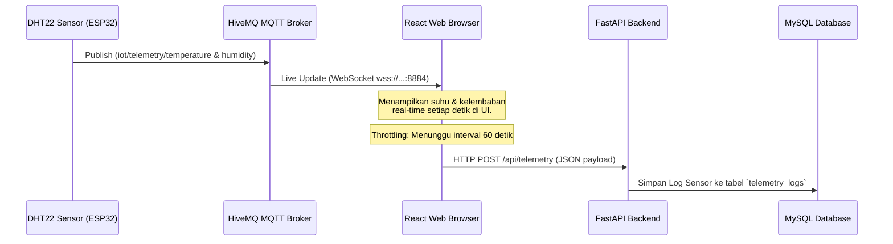
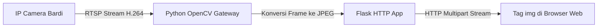

# Dokumentasi Sistem: Kampung Merak Inkubator IoT

Dokumen ini berisi penjelasan menyeluruh tentang arsitektur, cara kerja, alur data (*data flow*), dan spesifikasi teknologi yang digunakan dalam sistem pemantauan dan pencatatan Inkubator Telur Merak Kampung Merak.

---

## 1. Ikhtisar Sistem (System Overview)

Sistem ini dirancang untuk melakukan digitalisasi proses penangkaran telur merak pada inkubator Kampung Merak. Sistem memantau kondisi fisik inkubator secara real-time, merekam data silsilah telur, melacak transaksi keuangan, serta melakukan penyiaran langsung (*live streaming*) CCTV internal inkubator.

Sistem terdiri atas 3 komponen utama terpisah:
1. **Frontend Web (Client-Side):** Aplikasi antarmuka pengguna berbasis React.
2. **Backend API (Server-Side):** Server pemrosesan logika data berbasis FastAPI yang terhubung ke database relasional MySQL.
3. **CCTV Stream Server (Video Gateway):** Server perantara berbasis Python Flask & OpenCV untuk mengonversi feed kamera RTSP lokal menjadi format MJPEG yang didukung oleh browser web.

---

## 2. Spesifikasi Teknologi (Tech Stack)

### A. Frontend (Aplikasi Web)
- **Framework Utama:** React 18 (Vite 6 sebagai bundler pembangunan aset).
- **Styling & UI:** Tailwind CSS (dengan gaya *glassmorphism* bertema *Forest Midnight* dan hijau merak *Teal Iridescence*).
- **Konektivitas IoT:** `mqtt.js` (klien MQTT berbasis protokol WebSocket).
- **Pengolahan Grafik:** Chart.js / Custom SVG render untuk visualisasi data telemetri historis dan performa penetasan.
- **Penyimpanan Lokal:** *Web Storage API (localStorage)* sebagai mekanisme cadangan (*fallback*) luring.

### B. Backend REST API
- **Framework Utama:** Python 3.11+ dengan **FastAPI**.
- **Object Relational Mapper (ORM):** **SQLAlchemy** untuk interaksi basis data terstruktur tanpa query mentah.
- **Driver Database:** **PyMySQL** (konektor driver untuk MySQL).
- **Validasi Data:** **Pydantic** untuk validasi data masukan/keluaran JSON di setiap endpoint.
- **Database Server:** **MySQL** (atau MariaDB), dijalankan melalui modul XAMPP.

### C. CCTV Stream Server (Video Gateway)
- **Bahasa Pemrograman:** Python 3.11+ dengan framework mikro **Flask**.
- **Pemrosesan Gambar:** **OpenCV (Open Source Computer Vision Library)** untuk mengambil frame video RTSP dan melakukan kompresi frame demi frame menjadi JPEG.

---

## 3. Cara Kerja & Alur Data (System Flow)

### A. Alur Pemantauan Sensor Real-time (Telemetry Flow)


1. **Pengiriman Data (ESP32):** Mikrokontroler ESP32 di inkubator membaca suhu/kelembaban secara berkala dan mem-publish data ke broker HiveMQ Cloud.
2. **Konsumsi Web (MQTT):** Browser berlangganan (*subscribe*) ke topik telemetri dan memperbarui tampilan dashboard secara real-time tanpa membebani database.
3. **Throttling Pencatatan Database (Penting):** Untuk mencegah database MySQL membengkak akibat ribuan data masuk tiap menit, React menerapkan pembatasan waktu (*throttling*). React hanya mengirimkan request `POST` untuk menyimpan log ke tabel `telemetry_logs` database MySQL sekali setiap **60 detik**.

---

### B. Alur Manajemen Data & Keuangan (Database Sync Flow)
Tabel data telur (`eggs`) dan kas keuangan (`sales`) di website ini mendukung sinkronisasi dinamis dua arah.

```mermaid
graph TD
    User([Pengguna / Admin]) -->|Input Form/Edit UI| React[React Frontend]
    React -->|Cek .env: VITE_API_BASE_URL| Check{API Terkonfigurasi?}
    
    Check -->|Tidak / Kosong| LocalStorage[(Browser LocalStorage)]
    Note over LocalStorage: Data disimpan lokal di browser klien.<br/>Sifatnya luring (offline fallback).
    
    Check -->|Ya / Aktif| HTTP[Kirim HTTP Request]
    HTTP -->|POST / PUT / DELETE| FastAPI[FastAPI Server]
    FastAPI -->|Simpan / Edit SQL| MySQL[(MySQL Database XAMPP)]
    
    React -->|On App Mount / GET| FastAPI
    FastAPI -->|Ambil Data Awal| MySQL
```

1. **Inisialisasi Data:** Saat website dimuat (*app mount*), jika `VITE_API_BASE_URL` aktif, sistem melakukan `GET /api/eggs` dan `GET /api/sales` untuk mengisi dashboard web dengan data MySQL terbaru.
2. **Interseptor State Pintar:** Setiap kali user menambah/mengedit/menghapus telur atau mencatat kas masuk, React membandingkan kondisi *state* lama dan *state* baru:
   - **Data Bertambah:** Mengirim `POST` untuk menyimpan baris data baru ke tabel MySQL.
   - **Data Berubah:** Mengirim `PUT /api/{id}` untuk memperbarui nilai kolom tertentu di database MySQL (misal: mengubah status telur fertil menjadi menetas).
   - **Data Berkurang:** Mengirim `DELETE /api/{id}` untuk menghapus baris dari tabel MySQL.

---

### C. Alur Live Stream CCTV (Video Stream Flow)
Browser web modern tidak mendukung protokol kamera IP RTSP (`rtsp://`) secara langsung.



1. **Pengambilan Stream:** OpenCV dalam skrip Python (`server/rtsp_gateway_example.py`) terhubung ke kamera CCTV lokal melalui protokol RTSP port 554.
2. **Konversi Format:** OpenCV membaca video frame demi frame, mengubah resolusi/FPS agar lebih ringan, dan mengompresinya menjadi gambar JPEG.
3. **Multipart Streaming:** Flask memancarkan frame-frame JPEG tersebut secara kontinu menggunakan *content-type* `multipart/x-mixed-replace`. Browser web dapat langsung menampilkan aliran gambar ini menggunakan tag HTML standar ``.

---

## 4. Keamanan & Hak Akses (Role Permission Model)

Hak akses bersifat *Frontend Authorization* (untuk UI/UX) dan divalidasi dengan kode akses rahasia.

- **Admin:** Memiliki kontrol penuh atas perangkat IoT, pengaturan MQTT, pengisian slot nampan telur, melihat log sensor, manajemen akun pengguna, serta portal rekap kas masuk & penerbitan sertifikat silsilah digital (DCA).
- **Operator:** Memiliki akses ke monitoring sensor, kendali cepat aktuator, manajemen data nampan telur, serta pengaturan MQTT. Tidak dapat mengakses kas keuangan, rekap penjualan, dan manajemen akun pengguna.
- **Viewer:** Hak akses pemantauan pasif. Seluruh tombol kontrol, input data telur, perubahan pengaturan, dan rekap keuangan dikunci secara permanen.
